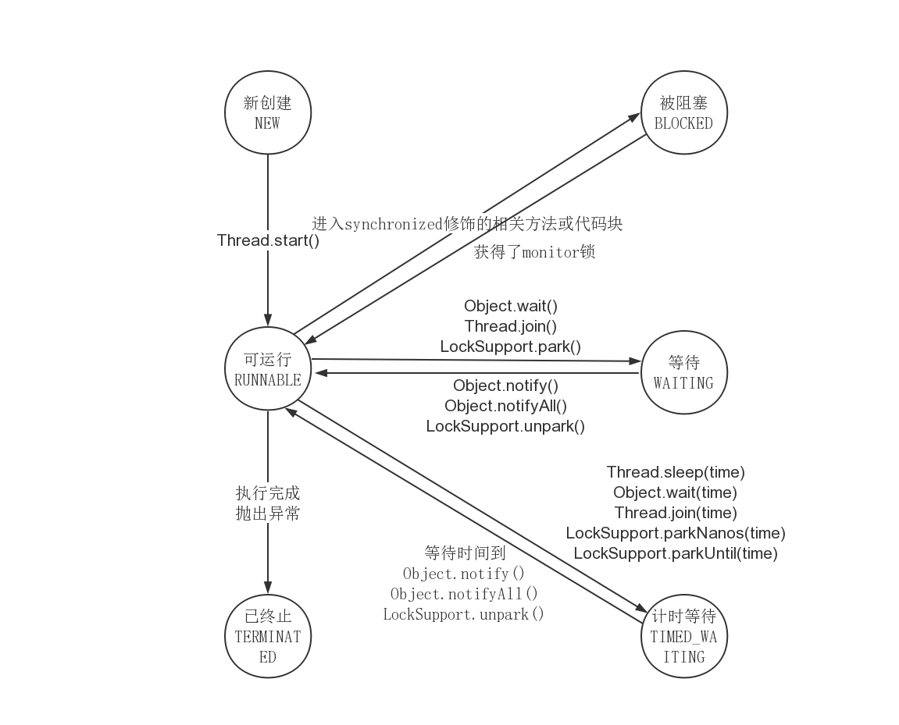

## 线程8大核心基础
### 一.实现线程的方法到底有多少种
1. 实现多线程的官方文档中指出,实现多线程的方法有`两种`
    - 实现Runnable接口[RunnableStyle.java](src/main/java/com/lyming/threadcoreknowledge/createthreads/RunnableStyle.java)
    - 继承Thread类[ThreadStyle.java](src/main/java/com/lyming/threadcoreknowledge/createthreads/ThreadStyle.java)
    - 两种方法对比:实现Runnable方法更好(解耦,资源消耗,java不支持双继承)
2. 两种方法的本质对比
    - Runnable:最终调用target.run()
    - Thread:run()整个都被重写
    - 同时使用两种方法会怎么样[BothRunnableThread.java](src/main/java/com/lyming/threadcoreknowledge/createthreads/BothRunnableThread.java)  
    根据本质的对比可以知道,Thread的run被重写,传入Runnable对象也不会被调用,所以最后还是Thread重写的方法
3. 总结 
    - Oracle官方文档写出,创建线程的方法有两种
    - 准确的说,创建线程只有一种方法,那就是构造Thread类,而实现线程的执行单元有两种方式
        - 实现Runnable接口的run()方法,并把Runnable实例传给Thread类
        - 重写Thread的run()方法(继承Thread类)
### 二.怎么才是启动线程的正确方式(start)
1. start()和run()方法的比较[StartAndRunMethod.java](src/main/java/com/lyming/threadcoreknowledge/startthread/StartAndRunMethod.java)
2. start()方法原理解读
    - 启动新线程:只是告诉jvm可以调动,调用start方法的顺序,并不代表线程运行顺序
    - start方法做的准备工作:让线程处于就绪状态
    - 不能两次调用start方法,否则会抛出异常[CantStartTwice.java](src/main/java/com/lyming/threadcoreknowledge/startthread/CantStartTwice.java)原因是因为
    ```java
       //Thread.start()
        if (threadStatus != 0)//检查线程状态,0代表New
            throw new IllegalThreadStateException();
    ```  
    - 顺序为启动新线程检查线程状态==>加入线程组==>调用native方法start0(),见Thread.java的start()方法
3. run()方法的原理解读
    ```java
       public void run() {
           //target是一个Runnable类
           if (target != null) {
               target.run();
           }
       }
    ```
### 三.如何正确停止线程(难点)
1. 停止线程的原理
    - 使用interrupt通知,而不是强制,因为被通知停止的线程更清楚何时停止,从而避免强制停止可能带来的混乱状态
2. 最佳实践:如何正确停止线程
    1. 通常什么时候线程会停止
        - run()方法都执行完毕
        - 出现异常,方法中没有捕获
        - 停止之后,它所占用的资源,内存都会被jvm回收
    2. 正确的停止方法:interrupt()
        - 通常情况[RightWayStopThreadWithoutSleep.java](src/main/java/com/lyming/threadcoreknowledge/stopthreads/RightWayStopThreadWithoutSleep.java)
        - 线程可能被阻塞[RightWayStopThreadWithSleep.java](src/main/java/com/lyming/threadcoreknowledge/stopthreads/RightWayStopThreadWithSleep.java)  
        会抛出异常,一般sleep()或者阻塞住都会在catch中相应中断
        - 如果线程在每次迭代后都阻塞[RightWayStopThreadWithSleepEveryLoop.java](src/main/java/com/lyming/threadcoreknowledge/stopthreads/RightWayStopThreadWithSleepEveryLoop.java)  
        如果在执行过程中，每次循环都会调用sleep或wait等方法，那么不需要每次迭代都检查是否已中断
        - 如果while里面放try/catch，会导致中断失效[CantInterrupt.java](src/main/java/com/lyming/threadcoreknowledge/stopthreads/CantInterrupt.java)  
        原因是因为sleep()设计的理念是响应后(catch中处理了),interrupt标记位会被清除
    3. 实际开发中的两种最佳实践
        - 优先选择:传递中断[RightWayStopThreadInProd.java](src/main/java/com/lyming/threadcoreknowledge/stopthreads/RightWayStopThreadInProd.java)
        - 不想或无法传递:恢复中断
        - 不应该屏蔽中断
        - 响应中断的方法总结列表
            - Object.wait()/wait(long)/wait(long,int)
            - Thread.sleep(long)/sleep(long,int)
            - Thread.join()/join(long)/join(long,int)
            - java.util.concurrent.BlockingQueue.take()/put(E)
            - java.util.concurrent.locks.Lock.lockInterruptibly()
            - java.util.concurrent.CountDownLatch.await()
            - java.util.concurrent.CyclicBarrier.await()
            - java.util.concurrent.Exchanger.exchange(V)
            - java.nio.channels.InterruptibleChannel相关方法
            - java.nio.channels.Selector的相关方法
        - Java异常体系  
          
        RuntimeException是Unchecked Exception,和error一样,都是能通过编译,但是jvm不能提前预知,其他的都是Checked Exception,这样的异常,编译器要求手动处理,或者抛出去
3. 错误的停止方法
    1. 被弃用的stop(),suspend(),resume()方法
        - [StopThread.java](src/main/java/com/lyming/threadcoreknowledge/stopthreads/StopThread.java)会造成脏数据
        - suspend()会带着锁挂起,容易造成死锁
    2. 用volatile设置boolean标记位(重点,很有迷惑性,看上去可行)
        - 看似可行的情况[WrongWayVolatile.java](src/main/java/com/lyming/threadcoreknowledge/stopthreads/volatiledemo/WrongWayVolatile.java)
        - 局限的情况,陷入阻塞时，volatile是无法停止线程的 此例中，生产者的生产速度很快，消费者消费速度慢，所以阻塞队列满了以后，生产者会阻塞,等待消费者进一步消费[WrongWayVolatileCantStop.java](src/main/java/com/lyming/threadcoreknowledge/stopthreads/volatiledemo/WrongWayVolatileCantStop.java)
        - 用interrupt()修复[WrongWayVolatileFixed.java](src/main/java/com/lyming/threadcoreknowledge/stopthreads/volatiledemo/WrongWayVolatileFixed.java)
4. 停止线程相关的重要函数解析
    - static boolean interrupted():检测当前线程是否被中断,返回值后会把线程中断状态清除
    - boolean isInterrupted():检测当前线程是否被中断
    - Thread1.interrupted()的目的对象是当前调用它的线程,并不一定是Thread1[RightWayInterrupted.java](src/main/java/com/lyming/threadcoreknowledge/stopthreads/RightWayInterrupted.java)
### 四.线程的生命周期,6种状态
1. 有哪6种状态
    - 
    - New:已创建但是没启动(start方法)
    - Runnable:调用了start方法后,其实Runnable代表两种状态==>Ready和Running
    - Blocked:当线程进入被`Synchronize`(只有Synchronize修饰,其他的lock都不算)修饰的代码块,锁被其他线程拿走的时候
    - Waiting:[BlockedWaitingTimedWaiting.java](src/main/java/com/lyming/threadcoreknowledge/sixstates/BlockedWaitingTimedWaiting.java)
    - Timed Waiting:[BlockedWaitingTimedWaiting.java](src/main/java/com/lyming/threadcoreknowledge/sixstates/BlockedWaitingTimedWaiting.java)
    - Terminate:正常结束或者出现异常
2. 阻塞状态是什么
    - 一般而言,把Blocked,Waiting,Timed_Waiting都成为阻塞状态,不仅仅是Blocked
### 五.Thread和Object类中的重要方法详解
1. 方法概览
2. wait(),notify(),notifyAll()
    - 用法分三个阶段:
        - 阻塞阶段:线程调用了wait就进入阻塞阶段,调用wait的前提是获得了monitor锁,直到遇到以下四种情况之一,才可能被唤醒  
        ①另一个线程调用这个对象的notify()方法而且刚好被唤醒的是本线程  
        ②另一个线程调用这个对象的notifyAll()方法  
        ③过了wait(long timeout)规定的超时时间,如果传入0就是永久等待  
        ④线程自身调用了interrupt()中断
        - 唤醒阶段:notify()是唤醒随机的线程,JVM不参与选取,notifyAll()是唤醒全部等待的线程
        - 遇到中断:进入wait()的线程,如果遇到中断,会抛出interruptException,并释放monitor锁
3. 代码示例
    - 展示wait和notify的基本用法 1. 研究代码执行顺序 2. 证明wait释放锁[Wait.java](src/main/java/com/lyming/threadcoreknowledge/threadobjectclasscommonmethods/Wait.java)
    - notify, notifyAll。 start先执行不代表线程先启动。[WaitNotifyAll](src/main/java/com/lyming/threadcoreknowledge/threadobjectclasscommonmethods/WaitNotifyAll.java)
    - wait只释放当前的那把锁[WaitNotifyReleaseOwnMonitor.java](src/main/java/com/lyming/threadcoreknowledge/threadobjectclasscommonmethods/WaitNotifyReleaseOwnMonitor.java)
    - wait(),notify(),notifyAll()的特点性质
        - 属于Object类,用之前必须拥有monitor,另外notify()只能唤醒其中一个
        - 这些方法都是native final
        - 类似功能有Condition
    - 手写生产者消费者设计模式
        - 什么是生产者消费者模式
        - 用wait/notify来实现生产者消费者模式[ProducerConsumerModel.java](src/main/java/com/lyming/threadcoreknowledge/threadobjectclasscommonmethods/ProducerConsumerModel.java)
    - 两个线程交替打印0~100的奇偶数[用synchronized关键字实现](src/main/java/com/lyming/threadcoreknowledge/threadobjectclasscommonmethods/WaitNotifyPrintOddEvenSyn.java),[用wait和notify实现,效率更高](src/main/java/com/lyming/threadcoreknowledge/threadobjectclasscommonmethods/WaitNotifyPrintOddEveWait.java)
    - wait()和notify()必须要在同步代码块中,有锁来保护,以免切换不受控制,会让锁
    - wait()属于Object类,那调用Thread.wait会怎么样?线程不适合作为锁,因为它会自动调用notify()方法
    - sleep():不释放锁(包括Synchronized和lock),[不释放synchronized的monitor](src/main/java/com/lyming/threadcoreknowledge/threadobjectclasscommonmethods/SleepDontReleaseMonitor.java),[不释放lock](src/main/java/com/lyming/threadcoreknowledge/threadobjectclasscommonmethods/SleepDontReleaseLock.java)
        - sleep()也能相应中断,和wait()相似,抛出InterruptedException,并清除中断状态[SleepInterrupted.java](src/main/java/com/lyming/threadcoreknowledge/threadobjectclasscommonmethods/SleepInterrupted.java)
    - join():谁用,别的线程都要等他
        - 普通用法==>[Join.java](src/main/java/com/lyming/threadcoreknowledge/threadobjectclasscommonmethods/Join.java)
        - 遇到中断==>[JoinInterrupt.java](src/main/java/com/lyming/threadcoreknowledge/threadobjectclasscommonmethods/JoinInterrupt.java)
        - join期间,线程所在的状态时Waiting==>[JoinThreadState.java](src/main/java/com/lyming/threadcoreknowledge/threadobjectclasscommonmethods/JoinThreadState.java)
        - 看源码可以看到,join主要就是用了wait()方法,但是没有看到notify,这也和上面介绍wait()方法时,不推荐用线程来做锁,因为在底层有一个`ensure_join`方法,调用了notifyAll()方法,线程在执行完毕会自动调用
        - 等待代码==>[JoinPrinciple.java](src/main/java/com/lyming/threadcoreknowledge/threadobjectclasscommonmethods/JoinPrinciple.java)
    - yield():释放CPU时间片,但是状态依然是Runnable,因为不会释放锁,也不会阻塞
        - 定位:JVM不保证遵循,也就是说即使调用了它,马上又被cpu调用(一般是CPU资源充足)
### 六.线程的各个属性
1. 线程各个属性总览
    - 
    - 
2. 线程id
    - [ID从1开始，JVM运行起来后，我们自己创建的线程的ID早已不是2](src/main/java/com/lyming/threadcoreknowledge/threadobjectclasscommonmethods/Id.java)
    ```java
     /* For generating thread ID ,默认值是0*/
        private static long threadSeqNumber;
        /* ++在前面,所以id从1开始 */
        private static synchronized long nextThreadID() {
            return ++threadSeqNumber;
        }
    ```
    - 自己创建的线程为什么不是2?因为JVM在后台为了程序运行的准备工作还创建了很多线程
3. 线程名字
    - 默认线程名字的源码
    ```java
      public Thread() {
          init(null, null, "Thread-" + nextThreadNum(), 0);
      }
    ```
    - 修改线程的名字
    ```java
   /* Java thread status for tools,
    * initialized to indicate thread 'not yet started'
    */
   /* 线程还没有启动的时候 */
   private volatile int threadStatus = 0;
   
    public final synchronized void setName(String name) {
        checkAccess();
        if (name == null) {
            throw new NullPointerException("name cannot be null");
        }
        /* Thread有两个名字,一个是name,一个是NativeName,后者一旦线程
           启动就无法更改 */
        this.name = name;
        if (threadStatus != 0) {
            setNativeName(name);
        }
    }
    ``` 
4. 守护线程
    - 作用:给用户线程提供服务,JVM停止(一般是代码执行完毕),守护线程停止(发现用户线程都停止了,没守护对象了)
    - 线程类型默认继承自父线程,即守护线程创建的线程都是守护线程,用户线程创建的线程都是用户线程,有一个修改守护属性的方法叫`setDeamon()`
    - 通常而言,守护线程都是由JVM自动启动,而不是用户去启动,JVM启动的时候有一个非守护线程==>main()函数
    - 守护线程不影响JVM退出,JVM想退出只看还有没有用户线程运行
    - 守护线程和用户线程基本相同,主要区别就是是否影响JVM退出,用户线程一般是做业务逻辑的,守护线程是服务于用户线程的
    - 是否需要手动将用户线程设置为守护线程?==>不应该,有风险,如果该线程涉及到业务逻辑的处理,可能会因为JVM退出,处理中断
5. 线程优先级
    - 10个级别,默认5,而且子线程默认也是5
    ``` 
        /**
         * 最低的优先级.
         */
        public final static int MIN_PRIORITY = 1;
    
       /**
         * 默认的优先级
         */
        public final static int NORM_PRIORITY = 5;
    
        /**
         * 最大的优先级
         */
        public final static int MAX_PRIORITY = 10;
    ```
    - 程序设计不应该依赖优先级
        - 不同操作系统优先级不一样,优先级高度依赖操作系统,比如java有10个优先级,windows只有7个优先级,所以需要映射,所以优先级不可靠
        - 优先级会被操作系统改变,比如在windows中有个优先级推进器,会根据哪个线程努力给它分配资源,而不是靠优先级,而且如果设置的优先级过低,可能会造成饥饿
### 七.未捕获异常如何处理
- UncaughtExceptionHandler类,未捕获异常处理器
    - 为什么需要它?==>①主线程可以轻松发现异常,子线程却不行.[多线程，子线程发生异常](src/main/java/com/lyming/threadcoreknowledge/uncaughtexception/ExceptionInChildThread.java),因为主线程发生异常,程序停止,子线程异常,虽然可以打印出异常信息,但是很不容易发现②子线程异常无法用传统方法捕获,[线程的异常不能用传统方法捕获](src/main/java/com/lyming/threadcoreknowledge/uncaughtexception/CantCatchDirectly.java)
    - [自己的MyUncaughtExceptionHanlder](src/main/java/com/lyming/threadcoreknowledge/uncaughtexception/MyUncaughtExceptionHandler.java),[UseOwnUncaughtExceptionHandler.java](src/main/java/com/lyming/threadcoreknowledge/uncaughtexception/UseOwnUncaughtExceptionHandler.java)
    - 异常处理器的调用策略ThreadGroup.uncaughtException
    ``` 
        public void uncaughtException(Thread t, Throwable e) {
            //默认情况下parent=null
            if (parent != null) {
                parent.uncaughtException(t, e);
            } else {
                /* 调用Thread.setDefaultUncaughtExceptionHandler(...)
                方法设置的全局Handler进行处理 */
                Thread.UncaughtExceptionHandler ueh =
                    Thread.getDefaultUncaughtExceptionHandler();
                if (ueh != null) {
                    ueh.uncaughtException(t, e);
                } else if (!(e instanceof ThreadDeath)) {
                    //全局Handler也不存在就输出异常栈
                    System.err.print("Exception in thread \""
                                     + t.getName() + "\" ");
                    e.printStackTrace(System.err);
                }
            }
        }
    ```
### 八.双刃剑:多线程会导致的问题
- 线程安全问题
    - 什么是线程安全?==>当多个线程访问一个对象时,如果不用考虑这些线程在运行时环境下的调度和交替执行,也不需要进行额外的同步,或者在调用方进行任何其他的协调操作,调用这个对象的行为都可以获得正确的结果,那这个对象时线程安全的
    - 线程不安全:get同时set就不安全,但是可以做额外同步做到线程同步
    - 什么情况下会出现线程安全问题:第一个主要是数据争用(比如多个线程同时去写),第二个竞争条件,指的是执行顺序上的错误
        - 运行结果错误:a++多线程下出现消失的请求现象,[MultiThreadsError.java](src/main/java/com/lyming/background/MultiThreadsError.java)
        - 活跃性问题:死锁,活锁,饥饿[MultiThreadError.java](src/main/java/com/lyming/background/MultiThreadError.java)
        - 对象发布和初始化的安全问题
            - 什么是发布:脱离了本类的调用
            - 什么是溢出(发布到了不该发布的地方)
                1. 方法返回一个private对象(private本意是不让外部访问),[发布溢出](src/main/java/com/lyming/background/MultiThreadsError3.java)
                2. 还未完成初始化(构造函数还没有完全执行完毕),就把对象提供给外部
                    1. 在构造函数中未初始化完毕就this赋值,[MultiThreadsError4.java](src/main/java/com/lyming/background/MultiThreadsError4.java)
                    2. 隐式溢出----注册监听事件,[观察者模式](src/main/java/com/lyming/background/MultiThreadsError5.java),修复==>[MultiThreadsError7.java](src/main/java/com/lyming/background/MultiThreadsError7.java)
                    3. 构造函数中运行线程,[MultiThreadsError6.java](src/main/java/com/lyming/background/MultiThreadsError6.java)
----
## java内存模型(JMM)
### 1.什么是底层原理
1. 从java代码到cpu指令
    1. 程序员编写.java文件的Java代码
    2. 经过编译(javac命令)后,*.java文件会生成一个新的java字节码文件(*.class)
    3. JVM会执行刚才生成的字节码文件,并把字节码文件转化为机器指令
    4. 机器指令可以直接在CPU上执行,也就是最终的程序运行
2. JVM实现会带来不同的翻译,不同CPU平台的机器指令又千差万别,无法保证并发安全的效果一致
### 2.三兄弟:JVM内存结构 java内存模型 java对象模型
- JVM内存结构:和Java虚拟机的运行时区域有关
- Java内存模型,和Java的并发编程有关
- Java对象模型,和Java对象在虚拟机中的表现形式有关
### 3.JMM是什么
- Java Memory Model是一组规范,需要各个JVM的实现来遵守JMM规范,以便于开发者可以利用这些规范,更方便开发并发程序,如果没有JMM内存模型规范,那么很可能经过不同的JVM的不同规则的重排序之后,导致不同虚拟机的运行结果不同
- volatile,Synchronized,Lock等底层原理都是JMM
### 4.重排序
- 重排序的例子:[OutOfOrderExecution.java](src/main/java/com/lyming/jmm/OutOfOrderExecution.java)
- 重排序的好处:提高处理速度
- 重排序的3种情况:编译器优化(包括JVM,JIT编译器),CPU指令重排序,内存的"重排序"==>线程A的修改,没及时写回主存,所以线程B却看不到,引出可见性问题,表面现象重排序
### 5.可见性
1. 什么是可见性问题,[演示可见性带来的问题](src/main/java/com/lyming/jmm/FieldVisibility.java)
    - 可能出现b=3,a=1
    - 加入volatile关键字,解决可见性问题,强制读取的值是最新的值
2. 为什么会出现可见性
    - Java作为高级语言,屏蔽了这些底层细节,用JMM定义了一套读写内存数据的规范,虽然我们不再需要关心一级缓存和二级缓存的问题,但是,JMM抽象了主内存和本地内存的概念
    - 这里说的本地内存并不是真的给一块每个线程分配的内存,而是JMM的一个抽象,是对于寄存器,一级缓存,二级缓存等的抽象
3. JMM的抽象:主内存和本地内存
    - JMM有以下的规定:
        1. 所有的变量都存储在主内存中,同时每个线程也有自己独立的工作内存,工作内存中的变量内容是主内存中的拷贝
        2. 线程不能直接读写主内存中的变量,而是只能操作自己工作内存中的变量,然后再同步到主内存中
        3. 主内存是多个线程共享的,但线程间不共享工作内存,如果线程间需要通信,必须借助主内存中转来完成
    - 所有的共享变量存在于主内存中,每个线程都有自己的本地内存,而且线程读写共享数据也是通过本地内存交换的,所有才导致了可见性问题
4. Happens-Before原则
    - 有哪些规则
        1. 单线程原则:不影响重排序
        2. 锁操作(Synchronized和Lock):加锁之后,对加锁之前的所有操作都可见
        3. volatile变量:一旦加了volatile修饰,一定能保证可见性
        4. 线程启动:子线程启动能看到主线程之前的操作
        5. 线程join:比如在主线程,子线程用了join(),就是要主线程等待,也防止了重排序
        6. 传递性:同一个线程中,如果hb(A,B),而且hb(B,C),那么可以推出hb(A,C)
        7. 中断:一个线程被其他线程interrupt时,那么检测中断(isInterruptd())或者抛出InterruptedException一定能看到
        8. 构造方法:对象构造方法的最后一行指令happens-before于finalize()方法的第一行指令
        9. 工具类的Happens-Before原则
            1. 线程安全的容器(比如ConcurrentHashMap)get一定能看到在此之前的put等存入动作
            2. CountDownLatch
            3. Semaphore
            4. Future
            5. 线程池
            6. CyclicBarrier
5. volatile关键字:[演示可见性带来的问题](src/main/java/com/lyming/jmm/FieldVisibility.java)
    - 有一个原则:近朱者赤==>给b加了volatile,不仅b被影响,也可以实现轻量级同步,就是说b之前的写入(对应代码b=a)对读取b后的代码都可见,所以在writeThread里对a的赋值,一定会对writeThread里的读取可见,所以这里的a`即使不加volatile,只要b读到是3,就可以由happens-before原则保证了读取到的都是3而不可能读取到1`.
    - volatile是一种同步机制,比synchronized或者Lock相关类更轻量,因为使用volatile并不会发生上下文切换等开销很大的行为
    - 如果一个变量被修饰成volatile,那么JVM就知道了这个变量可能会被并发修改
    - 如果开销小,相应的能力也小,虽然说volatile是用来同步的保证线程安全的,但是volatile做不到synchronized那样的原子保护,volatile仅在很有限的场景下才能发挥作用
    - volatile的适用场景
        - 不适用的场景:`a++`,[NoVolatile.java](src\main\java\com\lyming\jmm\NoVolatile.java)
        - 适用的场景1:boolean flag,如果一个共享变量自始至终只被各个线程赋值,而没有其他的操作,那么就可以用volatile来代替synchronized或者代替原子变量,因为赋值自身是有原子性的,而volatile又保证了可见性,所以就足以保证线程安全.[UseVolatile1.java](src\main\java\com\lyming\jmm\UseVolatile1.java),但是不能依赖之前的赋值,否则也是不安全的[NoVolatile2.java](src\main\java\com\lyming\jmm\NoVolatile2.java)
        - 适用的场景2:作为刷新之前变量的触发器,[b设置为volatile,作为触发器](src/main/java/com/lyming/jmm/FieldVisibility.java)
    - volatile的两点作用:
        - 可见性:读一个volatile变量之前,需要先使相应的本地缓存失效,这样就必须在主内存中读取到新值,写一个volatile属性会立即刷新到主内存
        - 禁止指令重排序优化:解决单例双重锁乱序问题
    - volatile和synchronized的关系
        - volatile在这方面可以看做是轻量版的synchronized:如果一个共享变量自始至终只被各个线程赋值,而没有其他的操作,那么就可以用volatile来代替synchronized或者代替原子变量,因为赋值自身是有原子性的,而volatile又保证了可见性,所以就满足线程安全.
        - 用volatile修正重排序问题,OutOfOrderExecution.java加入volatile后,用于不会出现(0,0)的情况
6. 保证可见性的措施
    - 除了volatile可以让变量保证可见性之外,synchronized,Lock,并发集合,Thread.join(),Thread.start()等都可以保证可见性,参考`happens-before`
7. 对Synchronized可见性的理解
    - synchronized不仅保证了原子性,还保证了可见性
    - synchronized不仅让被保护的代码安全,还近朱者赤
### 6.原子性
1. 什么是原子性
    - 一系列的操作,要么全部执行成功,要么全部不执行,不会出现执行一半的情况,是不可分割的.
    - ATM机取钱
    - i++不是原子性的
    - 用synchronized实现原子性
2. Java中的原子性操作有哪些
    - 除long和double之外的基本类型的赋值操作(int,byte,boolean,short,char,float)
    - 所有引用reference的赋值操作,不管是32位的机器还是64位的机器
    - java.concurrent.Atomic.*包中所有类的原子操作
3. long和double的原子性
    - 问题描述:官方文档,对于64位的值的写入,可以分为两个32位的操作进行写入,读取错误,使用volatile解决
    - 结论:在32位的JVM上,long和double的操作不是原子的,但是64位的JVM上是原子的
    - 实际开发中:商用Java虚拟机中不会出现
4. 原子操作+原子操作!=原子操作
    - 简单的把原子操作组合在一起,并不能保证整体依然具有原子性
### 7.面试常见问题
1. JMM应用实例:单例模式的8种写法,单例和并发的关系
    - 单例模式的作用:①节约内存和计算②保证结果正确③方便管理
    - 单例模式的8种写法(可用代表线程安全)
        1. 饿汉式（静态常量）（可用）[Singleton1](src\main\java\com\lyming\singleton\Singleton1.java)
        2. 饿汉式（静态代码块）（可用））[Singleton2](src\main\java\com\lyming\singleton\Singleton2.java)
        3. 懒汉式（线程不安全）[Singleton3](src\main\java\com\lyming\singleton\Singleton3.java)
        4. 懒汉式（线程安全）（不推荐）[Singleton4](src\main\java\com\lyming\singleton\Singleton4.java)
        5. 懒汉式（线程不安全）（不推荐）[Singleton5](src\main\java\com\lyming\singleton\Singleton5.java)
        6. 双重检查（推荐面试使用）[Singleton6](src\main\java\com\lyming\singleton\Singleton6.java)
        7. 静态内部类方式，可用 [Singleton7](src\main\java\com\lyming\singleton\Singleton7.java)
        6. 枚举单例(推荐用) [Singleton8](src\main\java\com\lyming\singleton\Singleton8.java)
    - 不同写法对比
        1. 饿汉:简单,但是没有lazy loading,如果对象的创建需要配置文件就不适用
        2. 懒汉:有线程安全问题
        3. 静态内部类:可用,但是静态内部类会引入编程复杂性
        4. 双重检查模式:面试用
        5. 枚举类:最好,开发环境推荐
    - `effective Java`中提出:使用枚举类实现单例模式已经成为Singleton的最佳方法,线程安全有保障,反编译之后枚举类实际就是静态的对象,也是懒加载,而且还有一个优势就是枚举能避免反序列化(反射)破坏单例
----
## 死锁---从产生到消除
### 1.发生死锁的例子
1. 什么是死锁?
    - 发生在并发中
    - 互不相让:当两个或者更多线程或进程互相持有对方所需要的资源,又不主动释放,导致所有人都无法继续前行,导致程序陷入无尽的阻塞,这就是死锁
    - 
    - 多个线程之间的依赖关系是环形,存在环路的锁的依赖关系,那么也可能会发生死锁
    - 
2. 死锁的影响
    - 死锁的影响在不同系统中是不一样的,这取决于系统对死锁的处理能力
        - 数据库中:监测并放弃事务
        - JVM中:无法自动处理
    - 几率不高但危害大
        - 不一定发生,但遵守`墨菲定律`
        - 一旦发生,多是高并发场景,影响用户多
        - 整个系统崩溃或子系统崩溃或性能降低
        - 压力测试无法找出所有潜在的死锁
3. 发生死锁的例子
    - 最简单的情况,[MustDeadLock](src\main\java\com\lyming\deadlock\MustDeadLock.java)
    - 实际生产中的例子:转账,[TransferMoney](src\main\java\com\lyming\deadlock\TransferMoney.java)
    - 模拟多人随机转账,[MultiTransferMoney](src\main\java\com\lyming\deadlock\MultiTransferMoney.java)
### 2.死锁的4个必要条件
1. 互斥条件
2. 请求与保持条件
3. 不剥夺条件
4. 循环等待条件
5. 以上条件缺一不可
### 3.修复死锁的策略
1. 如何定位死锁
    - jstack(命令):${JAVA_HOME}/bin/jstack pid
    - ThreadMXBean代码演示,[ThreadMXBeanDetection](src\main\java\com\lyming\deadlock\ThreadMXBeanDetection.java)
2. 线上发生死锁应该怎么办
    - 保存案发现场,重启服务器
    - 暂时保证线上服务的安全,然后利用保存的信息,排查分析,修改代码,重新发版
3. 常见的修复策略
    1. 避免策略:哲学家就餐的换手方案,转账换序方案
    2. 监测与恢复策略:一段时间检测是否有死锁,如果有就剥夺某一个资源,来打开死锁
        - 检测方法:锁的调用链路图
        - 恢复方法1:进程终止==>逐个终止线程,直到死锁消除,需要考虑的是终止顺序,根据①优先级(是前台交互还是后台处理)②已占用的资源,还需要的资源③已经运行的时间
        - 恢复方法2:资源抢占==>把已经分发出去的锁给收回来,让线程回退几步,这样几句不用结束整个线程,成本比较低.缺点=>可能同一个线程一直被抢占,造成饥饿
    3. 鸵鸟策略(不推荐):鸵鸟这种生物在遇到危险的时候,通常会把头埋在地上,这样一来,它就看不到危险了,而鸵鸟策略的意思就是说,如果我们发生死锁的概率极其低,那么我们就直接忽略它,直到发生死锁的时候,再人工修复
4. 哲学家就餐
    - 
    - 死锁:每个哲学家都拿着左手的筷子,都在等右手边的筷子(或者相反),[DiningPhilosophers](src\main\java\com\lyming\deadlock\DiningPhilosophers.java)
    - 多种解决方案
        - 服务员检查(避免策略)
        - `改变一个哲学家拿叉子的顺序`(避免策略)
        - 餐票(避免策略)
        - 领导调节(检测与恢复策略)
### 4.实际工作中如何避免死锁
1. 设置超时时间==>Lock的tryLock(long timeout,TimeUnit unit),synchronized不具备尝试锁的能力,造成超时的可能很多:死锁,线程死循环,线程执行很慢...,只要超时时间到了,就可以打日志,发报警邮件,重启等,[TryLockDeadlock](src\main\java\com\lyming\deadlock\TryLockDeadlock.java)
2. 多使用并发类而不是自己设计锁,比如ConcurrentHashMap,ConcurrentLinkedQueue,AtomicBoolean等,实际使用中,JUC.atomic十分有用,简单方便且效率比Lock更高,还有一点就是多用`并发集合`少用同步集合,并发集合比同步集合的可扩展性更好
3. 尽量降低锁的使用粒度,用不同的锁而不是一个锁
4. 如果能使用同步代码块,就不适用同步方法:自己指定锁对象
5. 给线程起一个有意义的名字:Debug和排查时候事半功倍
6. 避免锁的嵌套
7. 分配资源前先看能不能收回来:银行家算法
8. 尽量不要几个功能用同一把锁,而是要专锁专用
### 5.其他活性故障(又叫活跃性问题)
1. 死锁是最常见的活跃性问题,不过除了死锁之外,还有一些类似的问题,会导致程序无法顺利的执行,统称为活跃性问题
2. 活锁(liveLock)
    1. 什么是活锁
        - 死锁:每个哲学家都拿着左手的筷子,永远都在等右手边的筷子(或者相反)
        - 活锁:在完全相同的时候进入餐厅,并同时拿起左手边的筷子,那么这些哲学家就会等待五分钟,同时放下手中的筷子,再等五分钟,又同时拿起这些筷子
        - 虽然线程并没有阻塞,但始终在运行,但是程序却得不到进展,因为线程始终重复做同样的事
    2. 代码示例,[LiveLock](src\main\java\com\lyming\deadlock\LiveLock.java)
    3. 工程中活锁的实例:消息队列
        - 策略:消息如果处理失败,就放在队列开头重试,如果依赖服务出现了问题,处理该消息一直失败,那么程序没阻塞,但是程序无法继续,出现活锁
        - 解决方案: 放到队列尾部,重试限制
    4. 如何解决活锁问题
        - 原因:代码中重试机制不变,消息队列始终重试,吃饭始终谦让
        - 解决:以太网的指数退避算法,加入随机因素
3. 饥饿
    1. 定义:当线程需要某些资源(比如CPU),但是却始终得不到
    2. 原因:线程的优先级过于低,或者有某些线程持有锁同时又无限循环从而不释放锁,或者某程序始终占用某文件的写锁
    3. 造成后果:饥饿可能会导致响应性差:比如,我们的浏览器有一个线程负责前台相应(比如收藏夹等动作),另外的后台线程负责下载图片和文件,计算渲染等.在这种情况下,如果后台线程把CPU资源都占用了,那么前台线程无法得到很好的执行,这会导致用户的体验性很差.
### 6.面试常考问题
1. 写一个必然死锁的例子==>[MustDeadLock]([MustDeadLock](src\main\java\com\lyming\deadlock\MustDeadLock.java))
2. 生产中哪里容易发生死锁==>同一个方法获取不同的锁,库存增减,资产转移
3. 死锁必须满足哪些条件?==>1.互斥条件2.请求与保持条件3.不剥夺条件4.循环等待条件
4. 如何定位死锁?==>①jstack命令②ThreadMXBean
5. 有哪些解决死锁问题的策略==>①避免策略(优先)②检测与恢复:一段时间检测是否有死锁,如果有就剥夺资源,打开死锁③鸵鸟策略(不推荐)